[plantuml Web Server](https://www.plantuml.com/plantuml/uml/hLX1Rziu4xtxLn2vrFaQ1zysDoCmcatRNGFRRP44kyU0aIOs4OhqafGJf-t-zXNb4SKnAQX5UWbalZUZUSEP8PMtrd7ZwafENh5hjvF0B3WdrCfEx8DG6svunJQyUE0hsEC62iVLIa94A2Itzi8v8-vg1yj2gsln3Ep_4KKA1Mwt0QQDM-i8i6jUwiVcZUoUImkJ2RwD7Rs_l6OV6WeyQlDmnBvC67l5BhK19fG3SyyBi1FM_s3BIrrjj0BbFcijMmF6NhD_wVhqUCwsMfGD-cr2xQztra7L6-92Pu7BzQRa3gObICTlH0LpTYyrTvIqCRe0Qzyh9vm0IrwAGZ0cLd7LwAsQnmdRfx87FxQOmP1cx5R1axjfyZWFdFPd1_iKV-IREQkLDYKOA6yhlZdtoxT2bV1qGkqMdM4HfyWUsXER4xzd7jauSqvpkmZ-m0lVHJes8puf-BurNxvhtYMUuTQXuzVCm4fO1oPOdzyiV7A9D-Ikm97bSMeGWjH8w04S0hAHvQT71SQRXcn6BZnmmW25pLadaTID3sGF485PA-8vfAVIM_W-3wGYiV2E3cNk-uwMY6qieN3Qd9CGmjxpmeajNARqkyPdODqRWAKgHG4DuPyQQZZ7lKOjXG7VPmDAIx3EwDsqhUevbacIomifBtmqtirWqCXTUa-3MtVSlQCt-7NNcYGX4BlGyPZuNBiZ4Z8jodwRkZKhLegxsi2SNNUFoSxWkCWNBe9HuIxVJKKvN8aUF-xXVZq4uE7m0t5UbgJoY5Siq2mXkATeVllNt1xIV7LXjabUipEq4vKc6d1apuT7KeW75nUBP9U6pVk4BLwoVzWUUxTUVXeLxHHaZWqWhS8BByeIIZeyHcsk_FuIgz5H9y3-BTowBwfSgTFsJRCV70wBJ0txtiIJF-rDH98QikroTXBYhM6neDoHOpbra9nv--LiKuG4Z79uMUAjPX_MFFVc7xlmX06tpLzdza2ImZLNfGIJTefdBykJBhM_xtaVQbKueLL_yjPtjZ3Y3hm5NcUcwBG94UbK2bJ2nNJmZtCMLX9DLs1rRGh8o0fOeimWa4YppWYr8fljNnSaIStRrb7SPxbZtmi9yShmxXFRB3CKV04g9mg1BoyOJU7sbpCX8pdfa9GVse_wnu9AtM_JGIcKS89ByGpnKOFPdYR99HJBjp126UqEt1kYV7eybXLw4kRD3k5a3kJD44jiGl9IanYAgkYljaDPxOHivtX_ZsoGD-7wwFq_pTaDFkxwHq-R7iS_dcwtN3Q44xR3fmxM6p3SQVFQnuR-3w3PCFI_52grQnP3B1LVAU7g4k95fKqLQWVDKNyazUmxf3uJrMUnwZEg6f-UH_IV3Ui_6zP_DgY_CDfQoXfF2-M7eIcvdxrsBJPsmWu_pC-_dfvclZIyRVBXgsUpF1LFTaz8h7euSeChAJJW87H9OE7fs80u9NEc1CGtfGZrJcssaRDlqVz3VkCLi6MraUt0RXFiQux-Cm6Uk6Vuh5jdwiAney_Q2ayEfAXISLY5QWq__Ku63rUWIZ0PUmTF_dBsPpGS4NaKfLjJxsiGgxMZQvBl_0GNoYLtiQ0aDDf7lMsbxmaO1Rso3zyHV_He-dd_xC7mCOil2JvSB7BXNr7ivG82Qjh01rHTQYc55LgzHDZ8WVxp9HLhA1v2w8YcTzcq1eED9qITi2-hN-ZdP5X_awnli2dnK6a5BCXmfGXDkXy5xSJ00CBduEUseQPTNv-4biv__z0lIQXsr1AVri2bMt-teqztrl52GiuNcGidE196FO_SuVw0BSYfz7_ZIKJtj9lU-zE7Zf9353irYntKk_SSTeFDPbyNh7tqw_Gb3RZ83UC9m_V5jFqA8OKNZxZBK4zF5umMBfktdqBM7p3DyU5F_bbtq1XoUgCuF9mEXio4H9uZJ38X-j2Z6-ASrHRiv6tZggxaVm00)

```plantuml
@startuml

' Style settings
skinparam packageStyle rectangle
skinparam classAttributeIconSize 0
skinparam linetype ortho
skinparam shadowing false

package "ECS Framework" {
  ' Core interfaces
  interface IComponentPool {
    + ~IComponentPool(): void
  }

  interface ISystem {
    + ~ISystem(): void
    + update(deltaTime: float): void
    + processEntities(): void
  }

  ' Component management
  class ComponentManager {
    - _nextType: ComponentType
    - _typeMap: unordered_map<type_index, ComponentType>
    - _componentPools: unordered_map<ComponentType, shared_ptr<IComponentPool>>
    - _entityComponentMap: unordered_map<ComponentType, unordered_map<EntityID, size_t>>
    + registerComponent<T>(): ComponentType
    + getComponentType<T>(): ComponentType
    + getComponentPool<T>(): shared_ptr<ComponentPool<T>>
    + setComponentOwner<T>(component: shared_ptr<T>, entityID: EntityID): void
    + getEntityComponent<T>(entityID: EntityID): shared_ptr<T>
    + removeEntityComponent<T>(entityID: EntityID): void
  }

  class "ComponentPool<T>" {
    - _components: vector<shared_ptr<T>>
    - _activeComponents: vector<bool>
    - _freeIndices: queue<size_t>
    + create(): shared_ptr<T>
    + destroy(index: size_t): void
    + getAllActive(): vector<shared_ptr<T>>
    + getIndex(component: shared_ptr<T>): size_t
    + getByIndex(index: size_t): shared_ptr<T>
  }

  ' Entity management
  class Entity {
    - _id: EntityID
    - _signature: Signature
    - _componentManager: shared_ptr<ComponentManager>
    + setID(id: EntityID): void
    + getID(): EntityID
    + getSignature(): Signature
    + addComponent<T>(): void
    + removeComponent<T>(): void
    + getComponent<T>(): shared_ptr<T>
    + hasComponent<T>(): bool
  }

  class EntityManager {
    - _nextEntityID: EntityID
    - _entities: unordered_map<EntityID, shared_ptr<Entity>>
    - _signatures: unordered_map<EntityID, Signature>
    - _componentManager: shared_ptr<ComponentManager>
    + createEntity(): shared_ptr<Entity>
    + destroyEntity(entityID: EntityID): void
    + onComponentAdded<T>(entityID: EntityID): void
    + onComponentRemoved<T>(entityID: EntityID): void
    + getEntitiesWithSignature(signature: Signature): vector<shared_ptr<Entity>>
    + getEntity(entityID: EntityID): shared_ptr<Entity>
  }

  ' System management
  class SystemManager {
    - _systems: vector<shared_ptr<ISystem>>
    - _systemMap: unordered_map<type_index, shared_ptr<ISystem>>
    + registerSystem<T>(): shared_ptr<T>
    + getSystem<T>(): shared_ptr<T>
    + addSystem(system: shared_ptr<ISystem>): void
    + update(deltaTime: float): void
  }

  ' Event management
  class EventManager {
    - _handlers: unordered_map<EventId, vector<HandlerFunction>>
    + subscribe<EventType>(handler: function): void
    + emit<EventType>(event: EventType): void
  }

  ' Resource management
  class ResourceManager {
    - _resources: unordered_map<string, shared_ptr<void>>
    + load<T>(name: string, filename: string): shared_ptr<T>
    + get<T>(name: string): shared_ptr<T>
  }

  ' Scene management
  class Scene {
    - _componentManager: shared_ptr<ComponentManager>
    - _entityManager: shared_ptr<EntityManager>
    - _systemManager: shared_ptr<SystemManager>
    - _eventManager: shared_ptr<EventManager>
    + initialize(): void
    + load(filename: string): void
    + save(filename: string): void
    + update(deltaTime: float): void
    + getEntityManager(): shared_ptr<EntityManager>
    + getComponentManager(): shared_ptr<ComponentManager>
    + getSystemManager(): shared_ptr<SystemManager>
    + getEventManager(): shared_ptr<EventManager>
  }

  ' Vector utilities
  class "Vec2<T>" {
    + x: T
    + y: T
    + Vec2()
    + Vec2(x_val: T, y_val: T)
    + operator+(): Vec2<T>
    + operator-(): Vec2<T>
    + operator*(): Vec2<T>
    + dot(): T
    + magnitude(): T
    + normalize(): Vec2<T>
  }

  class "Vec3<T>" {
    + x: T
    + y: T
    + z: T
    + Vec3()
    + Vec3(x_val: T, y_val: T, z_val: T)
    + operator+(): Vec3<T>
    + operator-(): Vec3<T>
    + operator*(): Vec3<T>
    + dot(): T
    + cross(): Vec3<T>
    + magnitude(): T
    + normalize(): Vec3<T>
  }

  ' Relationships
  IComponentPool <|.. "ComponentPool<T>"

  ComponentManager o-- "ComponentPool<T>"

  Entity o-- ComponentManager

  EntityManager o-- Entity
  EntityManager o-- ComponentManager

  SystemManager o-- ISystem

  Scene o-- ComponentManager
  Scene o-- EntityManager
  Scene o-- SystemManager
  Scene o-- EventManager
}

package "Game Implementation" {
  ' Component examples
  struct "PositionComponent" {
    + x: float
    + y: float
  }

  struct "RenderComponent" {
    + textureName: string
    + width: float
    + height: float
    + layer: int
  }

  ' System examples
  class "MovementSystem" {
    - _entities: vector<shared_ptr<Entity>>
    - _entityManager: shared_ptr<EntityManager>
    + update(deltaTime: float): void
    + processEntities(): void
  }

  class "RenderSystem" {
    - _entities: vector<shared_ptr<Entity>>
    - _resourceManager: shared_ptr<ResourceManager>
    + update(deltaTime: float): void
    + processEntities(): void
    + render(): void
  }

  class "CollisionSystem" {
    - _entities: vector<shared_ptr<Entity>>
    - _eventManager: shared_ptr<EventManager>
    + update(deltaTime: float): void
    + processEntities(): void
    + checkCollisions(): void
  }

  ' Event examples
  class "CollisionEvent" {
    + entity1: EntityID
    + entity2: EntityID
    + position: Vec2<float>
    + normal: Vec2<float>
  }

  class "GameScene" {
    + createPlayer(x: float, y: float): shared_ptr<Entity>
    + createEnemy(x: float, y: float, health: float): shared_ptr<Entity>
    + createObstacle(x: float, y: float, width: float, height: float): shared_ptr<Entity>
    + initialize(): void
    + loadLevel(levelName: string): void
  }

  ISystem <|.. MovementSystem
  ISystem <|.. RenderSystem
  ISystem <|.. CollisionSystem

  GameScene --|> Scene

  MovementSystem --> "PositionComponent"
  RenderSystem --> "RenderComponent"
  CollisionSystem --> "PositionComponent"

  CollisionSystem ..> CollisionEvent : emits
}

' Cross-package relationships
GameScene o-- ResourceManager
RenderSystem o-- ResourceManager

"PositionComponent" --> "Vec2<T>" : uses

@enduml

```

