# C++ ECS (Entity Component System)

## Table of Contents
1. [What is an ECS?](#what-is-an-ecs)
2. [Architecture Overview](#diagram)
3. [API Reference](#api-reference)
   - [ComponentManager](#componentmanager)
   - [IComponentPool & ComponentPool](#icomponentpool--componentpool)
   - [Entity](#entity)
   - [EntityManager](#entitymanager)
   - [SystemManager](#systemmanager)
   - [ISystem](#isystem)
   - [EventManager](#eventmanager)
   - [ResourceManager](#resourcemanager)
   - [Scene](#scene)

## What is an ECS?

The Entity Component System (ECS) is an architectural pattern primarily used in game development that focuses on composition over inheritance for maximum flexibility and performance.

### Entities
Entities are the basic objects in your game or application. Here, an entity is essentially just an ID with a signature that indicates which components it has. Entities have no behavior of their own.

### Signatures
Signatures are bitsets that track which components an entity has. They enable efficient filtering of entities for systems.

### Components
Components are pure data structures that store the attributes of entities. Each component type represents a specific aspect of an entity, such as position, rendering information, or health.

### Systems
Systems contain the logic that operates on entities with specific component combinations. Each system processes entities that match its required component signature.

### Events
Events allow for communication between different parts of the system without creating direct dependencies.

## Architecture Overview

```plantuml
@startuml

' Style settings
skinparam packageStyle rectangle
skinparam classAttributeIconSize 0
skinparam linetype ortho
skinparam shadowing false

package "ECS Framework" {
  ' Core interfaces
  interface IComponentPool {
    + ~IComponentPool(): void
  }

  interface ISystem {
    + ~ISystem(): void
    + update(deltaTime: float): void
    + processEntities(): void
  }

  ' Component management
  class ComponentManager {
    - _nextType: ComponentType
    - _typeMap: unordered_map<type_index, ComponentType>
    - _componentPools: unordered_map<ComponentType, shared_ptr<IComponentPool>>
    - _entityComponentMap: unordered_map<ComponentType, unordered_map<EntityID, size_t>>
    + registerComponent<T>(): ComponentType
    + getComponentType<T>(): ComponentType
    + getComponentPool<T>(): shared_ptr<ComponentPool<T>>
    + setComponentOwner<T>(component: shared_ptr<T>, entityID: EntityID): void
    + getEntityComponent<T>(entityID: EntityID): shared_ptr<T>
    + removeEntityComponent<T>(entityID: EntityID): void
  }

  class "ComponentPool<T>" {
    - _components: vector<shared_ptr<T>>
    - _activeComponents: vector<bool>
    - _freeIndices: queue<size_t>
    + create(): shared_ptr<T>
    + destroy(index: size_t): void
    + getAllActive(): vector<shared_ptr<T>>
    + getIndex(component: shared_ptr<T>): size_t
    + getByIndex(index: size_t): shared_ptr<T>
  }

  ' Entity management
  class Entity {
    - _id: EntityID
    - _signature: Signature
    - _componentManager: shared_ptr<ComponentManager>
    + setID(id: EntityID): void
    + getID(): EntityID
    + getSignature(): Signature
    + addComponent<T>(): void
    + removeComponent<T>(): void
    + getComponent<T>(): shared_ptr<T>
    + hasComponent<T>(): bool
  }

  class EntityManager {
    - _nextEntityID: EntityID
    - _entities: unordered_map<EntityID, shared_ptr<Entity>>
    - _signatures: unordered_map<EntityID, Signature>
    - _componentManager: shared_ptr<ComponentManager>
    + createEntity(): shared_ptr<Entity>
    + destroyEntity(entityID: EntityID): void
    + onComponentAdded<T>(entityID: EntityID): void
    + onComponentRemoved<T>(entityID: EntityID): void
    + getEntitiesWithSignature(signature: Signature): vector<shared_ptr<Entity>>
    + getEntity(entityID: EntityID): shared_ptr<Entity>
  }

  ' System management
  class SystemManager {
    - _systems: vector<shared_ptr<ISystem>>
    - _systemMap: unordered_map<type_index, shared_ptr<ISystem>>
    + registerSystem<T>(): shared_ptr<T>
    + getSystem<T>(): shared_ptr<T>
    + addSystem(system: shared_ptr<ISystem>): void
    + update(deltaTime: float): void
  }

  ' Event management
  class EventManager {
    - _handlers: unordered_map<EventId, vector<HandlerFunction>>
    + subscribe<EventType>(handler: function): void
    + emit<EventType>(event: EventType): void
  }

  ' Resource management
  class ResourceManager {
    - _resources: unordered_map<string, shared_ptr<void>>
    + load<T>(name: string, filename: string): shared_ptr<T>
    + get<T>(name: string): shared_ptr<T>
  }

  ' Scene management
  class Scene {
    - _componentManager: shared_ptr<ComponentManager>
    - _entityManager: shared_ptr<EntityManager>
    - _systemManager: shared_ptr<SystemManager>
    - _eventManager: shared_ptr<EventManager>
    + initialize(): void
    + load(filename: string): void
    + save(filename: string): void
    + update(deltaTime: float): void
    + getEntityManager(): shared_ptr<EntityManager>
    + getComponentManager(): shared_ptr<ComponentManager>
    + getSystemManager(): shared_ptr<SystemManager>
    + getEventManager(): shared_ptr<EventManager>
  }

  ' Vector utilities
  class "Vec2<T>" {
    + x: T
    + y: T
    + Vec2()
    + Vec2(x_val: T, y_val: T)
    + operator+(): Vec2<T>
    + operator-(): Vec2<T>
    + operator*(): Vec2<T>
    + dot(): T
    + magnitude(): T
    + normalize(): Vec2<T>
  }

  class "Vec3<T>" {
    + x: T
    + y: T
    + z: T
    + Vec3()
    + Vec3(x_val: T, y_val: T, z_val: T)
    + operator+(): Vec3<T>
    + operator-(): Vec3<T>
    + operator*(): Vec3<T>
    + dot(): T
    + cross(): Vec3<T>
    + magnitude(): T
    + normalize(): Vec3<T>
  }

  ' Relationships
  IComponentPool <|.. "ComponentPool<T>"

  ComponentManager o-- "ComponentPool<T>"

  Entity o-- ComponentManager

  EntityManager o-- Entity
  EntityManager o-- ComponentManager

  SystemManager o-- ISystem

  Scene o-- ComponentManager
  Scene o-- EntityManager
  Scene o-- SystemManager
  Scene o-- EventManager
}

package "Game Implementation" {
  ' Component examples
  struct "PositionComponent" {
    + x: float
    + y: float
  }

  struct "RenderComponent" {
    + textureName: string
    + width: float
    + height: float
    + layer: int
  }

  ' System examples
  class "MovementSystem" {
    - _entities: vector<shared_ptr<Entity>>
    - _entityManager: shared_ptr<EntityManager>
    + update(deltaTime: float): void
    + processEntities(): void
  }

  class "RenderSystem" {
    - _entities: vector<shared_ptr<Entity>>
    - _resourceManager: shared_ptr<ResourceManager>
    + update(deltaTime: float): void
    + processEntities(): void
    + render(): void
  }

  class "CollisionSystem" {
    - _entities: vector<shared_ptr<Entity>>
    - _eventManager: shared_ptr<EventManager>
    + update(deltaTime: float): void
    + processEntities(): void
    + checkCollisions(): void
  }

  ' Event examples
  class "CollisionEvent" {
    + entity1: EntityID
    + entity2: EntityID
    + position: Vec2<float>
    + normal: Vec2<float>
  }

  class "GameScene" {
    + createPlayer(x: float, y: float): shared_ptr<Entity>
    + createEnemy(x: float, y: float, health: float): shared_ptr<Entity>
    + createObstacle(x: float, y: float, width: float, height: float): shared_ptr<Entity>
    + initialize(): void
    + loadLevel(levelName: string): void
  }

  ISystem <|.. MovementSystem
  ISystem <|.. RenderSystem
  ISystem <|.. CollisionSystem

  GameScene --|> Scene

  MovementSystem --> "PositionComponent"
  RenderSystem --> "RenderComponent"
  CollisionSystem --> "PositionComponent"

  CollisionSystem ..> CollisionEvent : emits
}

' Cross-package relationships
GameScene o-- ResourceManager
RenderSystem o-- ResourceManager

"PositionComponent" --> "Vec2<T>" : uses

@enduml

```



## API Reference

### ComponentManager

The `ComponentManager` is responsible for registering component types, creating component pools, and tracking entity-component associations.

#### `template<typename T> ComponentType registerComponent()`
Registers a component type in the system and assigns it a unique ID.

**Returns:**
- `ComponentType`: The assigned component type ID

**Example:**
```cpp
ECS::ComponentManager componentManager;
ECS::ComponentType positionType = componentManager.registerComponent<PositionComponent>();
```

#### `template<typename T> ComponentType getComponentType()`
Gets the unique ID of a previously registered component type.

**Returns:**
- `ComponentType`: The component type ID

**Throws:**
- `std::runtime_error`: If the component type is not registered

**Example:**
```cpp
ECS::ComponentType healthType = componentManager.getComponentType<HealthComponent>();
```

#### `template<typename T> std::shared_ptr<ComponentPool<T>> getComponentPool()`
Gets the component pool for a specific component type.

**Returns:**
- `std::shared_ptr<ComponentPool<T>>`: The component pool

**Throws:**
- `std::runtime_error`: If the component type is not registered

**Example:**
```cpp
auto positionPool = componentManager.getComponentPool<PositionComponent>();
```

#### `template<typename T> void setComponentOwner(std::shared_ptr<T>, EntityID)`
Associates a component with an entity.

**Parameters:**
- `component`: The component to associate
- `entityID`: The ID of the entity

**Example:**
```cpp
auto position = positionPool->create();
componentManager.setComponentOwner<PositionComponent>(position, entityID);
```

#### `template<typename T> std::shared_ptr<T> getEntityComponent(EntityID)`
Gets a component for a specific entity.

**Parameters:**
- `entityID`: The ID of the entity

**Returns:**
- `std::shared_ptr<T>`: The component, or nullptr if not found

**Example:**
```cpp
auto health = componentManager.getEntityComponent<HealthComponent>(playerID);
```

#### `template<typename T> void removeEntityComponent(EntityID)`
Removes a component from an entity.

**Parameters:**
- `entityID`: The ID of the entity

**Example:**
```cpp
componentManager.removeEntityComponent<TemporaryEffectComponent>(enemyID);
```

### IComponentPool & ComponentPool

`IComponentPool` defines the interface for component storage, while `ComponentPool<T>` implements efficient storage and retrieval for a specific component type.

#### `std::shared_ptr<T> create()`
Creates a new component in the pool.

**Returns:**
- `std::shared_ptr<T>`: The newly created component

**Example:**
```cpp
auto position = positionPool->create();
```

#### `void destroy(std::size_t index)`
Destroys a component at the specified index.

**Parameters:**
- `index`: The index of the component to destroy

**Example:**
```cpp
positionPool->destroy(componentIndex);
```

#### `std::vector<std::shared_ptr<T>> getAllActive()`
Gets all active components in the pool.

**Returns:**
- `std::vector<std::shared_ptr<T>>`: All active components

**Example:**
```cpp
auto allPositions = positionPool->getAllActive();
```

#### `size_t getIndex(const std::shared_ptr<T> &component)`
Gets the index of a component in the pool.

**Parameters:**
- `component`: The component to find

**Returns:**
- `size_t`: The index of the component

**Example:**
```cpp
size_t index = positionPool->getIndex(position);
```

#### `std::shared_ptr<T> getByIndex(size_t index)`
Gets a component by its index.

**Parameters:**
- `index`: The index of the component

**Returns:**
- `std::shared_ptr<T>`: The component, or nullptr if not found

**Example:**
```cpp
auto position = positionPool->getByIndex(componentIndex);
```

### Entity

The `Entity` class represents an individual game object that can have multiple components.

#### `void setID(EntityID id)`
Sets the unique ID of the entity.

**Parameters:**
- `id`: The ID to set

**Example:**
```cpp
entity->setID(nextEntityID++);
```

#### `EntityID getID() const`
Gets the unique ID of the entity.

**Returns:**
- `EntityID`: The entity's ID

**Example:**
```cpp
EntityID id = entity->getID();
```

#### `Signature getSignature() const`
Gets the component signature of the entity.

**Returns:**
- `Signature`: The entity's component signature

**Example:**
```cpp
Signature signature = entity->getSignature();
```

#### `template<typename T> void addComponent()`
Adds a component of type T to the entity.

**Example:**
```cpp
entity->addComponent<PositionComponent>();
```

#### `template<typename T> void removeComponent()`
Removes a component of type T from the entity.

**Example:**
```cpp
entity->removeComponent<TemporaryEffectComponent>();
```

#### `template<typename T> std::shared_ptr<T> getComponent()`
Gets a component of type T from the entity.

**Returns:**
- `std::shared_ptr<T>`: The component, or nullptr if not found

**Example:**
```cpp
auto position = entity->getComponent<PositionComponent>();
```

#### `template<typename T> bool hasComponent() const`
Checks if the entity has a component of type T.

**Returns:**
- `bool`: True if the entity has the component, false otherwise

**Example:**
```cpp
if (entity->hasComponent<CollisionComponent>()) {
    // Handle collision
}
```

### EntityManager

The `EntityManager` is responsible for creating, tracking, and destroying entities.

#### `EntityManager(std::shared_ptr<ComponentManager> componentManager)`
Constructor that takes a component manager.

**Parameters:**
- `componentManager`: A shared pointer to a component manager

**Example:**
```cpp
auto componentManager = std::make_shared<ECS::ComponentManager>();
auto entityManager = std::make_shared<ECS::EntityManager>(componentManager);
```

#### `std::shared_ptr<Entity> createEntity()`
Creates a new entity.

**Returns:**
- `std::shared_ptr<Entity>`: The newly created entity

**Example:**
```cpp
auto player = entityManager->createEntity();
```

#### `void destroyEntity(EntityID)`
Destroys an entity with the specified ID.

**Parameters:**
- `entityID`: The ID of the entity to destroy

**Example:**
```cpp
entityManager->destroyEntity(enemyID);
```

#### `template<typename T> void onComponentAdded(EntityID entityID)`
Updates the entity signature when a component is added.

**Parameters:**
- `entityID`: The ID of the entity

**Example:**
```cpp
entity->addComponent<PositionComponent>();
entityManager->onComponentAdded<PositionComponent>(entity->getID());
```

#### `template<typename T> void onComponentRemoved(EntityID entityID)`
Updates the entity signature when a component is removed.

**Parameters:**
- `entityID`: The ID of the entity

**Example:**
```cpp
entity->removeComponent<TemporaryEffectComponent>();
entityManager->onComponentRemoved<TemporaryEffectComponent>(entity->getID());
```

#### `std::vector<std::shared_ptr<Entity>> getEntitiesWithSignature(Signature)`
Gets all entities that match a specific component signature.

**Parameters:**
- `signature`: The component signature to match

**Returns:**
- `std::vector<std::shared_ptr<Entity>>`: All matching entities

**Example:**
```cpp
Signature signature;
signature.set(componentManager->getComponentType<PositionComponent>());
signature.set(componentManager->getComponentType<RenderComponent>());
auto renderableEntities = entityManager->getEntitiesWithSignature(signature);
```

#### `std::shared_ptr<Entity> getEntity(EntityID entityID)`
Gets an entity by its ID.

**Parameters:**
- `entityID`: The ID of the entity

**Returns:**
- `std::shared_ptr<Entity>`: The entity, or nullptr if not found

**Example:**
```cpp
auto player = entityManager->getEntity(playerID);
```

#### `std::shared_ptr<ComponentManager> getComponentManager() const`
Gets the ComponentManager member of the class.

**Returns:**
- `std::shared_ptr<ComponentManager>` : The member of the class.

**Example**
```cpp
auto componentManager = _scene.getComponentManager();
```

### SystemManager

The `SystemManager` is responsible for creating, tracking, and updating systems.

#### `template<typename T> std::shared_ptr<T> registerSystem()`
Registers a system of type T.

**Returns:**
- `std::shared_ptr<T>`: The newly registered system

**Example:**
```cpp
auto movementSystem = systemManager->registerSystem<MovementSystem>();
```

#### `template<typename T> std::shared_ptr<T> getSystem()`
Gets a system of type T.

**Returns:**
- `std::shared_ptr<T>`: The system, or nullptr if not found

**Example:**
```cpp
auto renderSystem = systemManager->getSystem<RenderSystem>();
```

#### `void addSystem(std::shared_ptr<ISystem> system)`
Adds a system to the manager.

**Parameters:**
- `system`: The system to add

**Example:**
```cpp
auto customSystem = std::make_shared<CustomSystem>();
systemManager->addSystem(customSystem);
```

#### `void update(float deltaTime)`
Updates all systems.

**Parameters:**
- `deltaTime`: The time elapsed since the last update

**Example:**
```cpp
float deltaTime = 0.016f; // ~60 FPS
systemManager->update(deltaTime);
```

### ISystem

The `ISystem` interface defines the basic structure for all systems.

#### `virtual void update(float deltaTime) = 0`
Updates the system with the elapsed time.

**Parameters:**
- `deltaTime`: The time elapsed since the last update

**Example:**
```cpp
void MovementSystem::update(float deltaTime) override {
    processEntities();
}
```

#### `virtual void processEntities() = 0`
Processes all entities that match the system's requirements.

**Example:**
```cpp
void MovementSystem::processEntities() override {
    for (auto& entity : _entities) {
        auto position = entity->getComponent<PositionComponent>();
        auto velocity = entity->getComponent<VelocityComponent>();

        if (position && velocity) {
            position->x += velocity->x * _deltaTime;
            position->y += velocity->y * _deltaTime;
        }
    }
}
```

### EventManager

The `EventManager` implements a type-safe event system using the observer pattern.

#### `template<typename EventType> void subscribe(std::function<void(const EventType &)>)`
Subscribes to events of a specific type.

**Parameters:**
- `handler`: A function to handle the event

**Example:**
```cpp
eventManager->subscribe<CollisionEvent>([](const CollisionEvent& event) {
    std::cout << "Collision between " << event.entity1 << " and " << event.entity2 << std::endl;
});
```

#### `template<typename EventType> void emit(const EventType &)`
Emits an event of a specific type.

**Parameters:**
- `event`: The event to emit

**Example:**
```cpp
CollisionEvent collision = { player->getID(), enemy->getID() };
eventManager->emit(collision);
```

### ResourceManager

The `ResourceManager` handles loading, caching, and retrieving game resources.

#### `template<typename T> std::shared_ptr<T> load(const std::string &name, const std::string &filename)`
Loads a resource from a file and caches it with a name.

**Parameters:**
- `name`: The name to associate with the resource
- `filename`: The file to load the resource from

**Returns:**
- `std::shared_ptr<T>`: The loaded resource

**Example:**
```cpp
auto texture = resourceManager->load<Texture>("player", "assets/player.png");
```

#### `template<typename T> std::shared_ptr<T> get(const std::string &name)`
Gets a previously loaded resource by name.

**Parameters:**
- `name`: The name of the resource

**Returns:**
- `std::shared_ptr<T>`: The resource, or nullptr if not found

**Example:**
```cpp
auto texture = resourceManager->get<Texture>("player");
```

### Scene

The `Scene` class brings together all parts of the ECS to create a complete game scene. (This is just an implementation example, you'll have to create your own)

#### `Scene()`
Default constructor that initializes all managers.

**Example:**
```cpp
ECS::Scene scene;
```

#### `void initialize()`
Initializes the scene by registering components and systems.

**Example:**
```cpp
scene.initialize();
```

#### `void load(const std::string &filename)`
Loads a scene from a file.

**Parameters:**
- `filename`: The file to load the scene from

**Example:**
```cpp
scene.load("level1.scn");
```

#### `void save(const std::string &filename)`
Saves a scene to a file.

**Parameters:**
- `filename`: The file to save the scene to

**Example:**
```cpp
scene.save("savegame.scn");
```

#### `void update(float deltaTime)`
Updates the scene.

**Parameters:**
- `deltaTime`: The time elapsed since the last update

**Example:**
```cpp
scene.update(0.016f);
```

#### `std::shared_ptr<EntityManager> getEntityManager()`
Gets the entity manager.

**Returns:**
- `std::shared_ptr<EntityManager>`: The entity manager

**Example:**
```cpp
auto entityManager = scene.getEntityManager();
```

#### `std::shared_ptr<ComponentManager> getComponentManager()`
Gets the component manager.

**Returns:**
- `std::shared_ptr<ComponentManager>`: The component manager

**Example:**
```cpp
auto componentManager = scene.getComponentManager();
```

#### `std::shared_ptr<SystemManager> getSystemManager()`
Gets the system manager.

**Returns:**
- `std::shared_ptr<SystemManager>`: The system manager

**Example:**
```cpp
auto systemManager = scene.getSystemManager();
```

#### `std::shared_ptr<EventManager> getEventManager()`
Gets the event manager.

**Returns:**
- `std::shared_ptr<EventManager>`: The event manager

**Example:**
```cpp
auto eventManager = scene.getEventManager();
```
